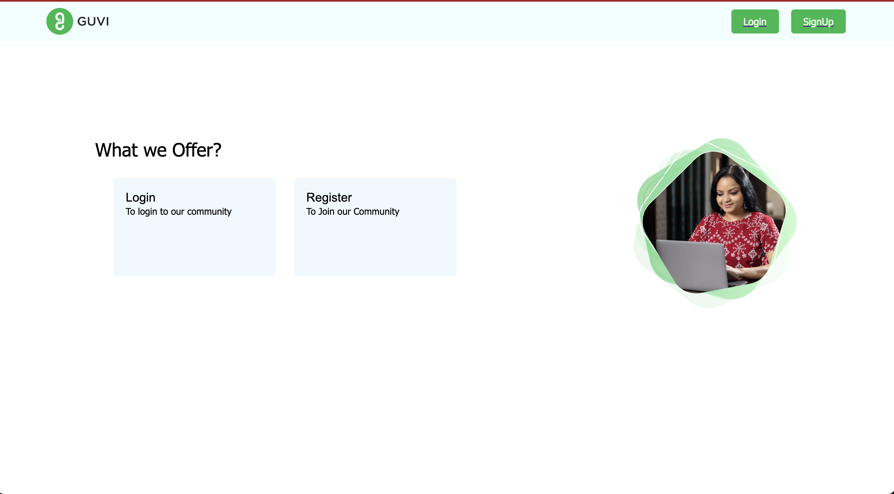
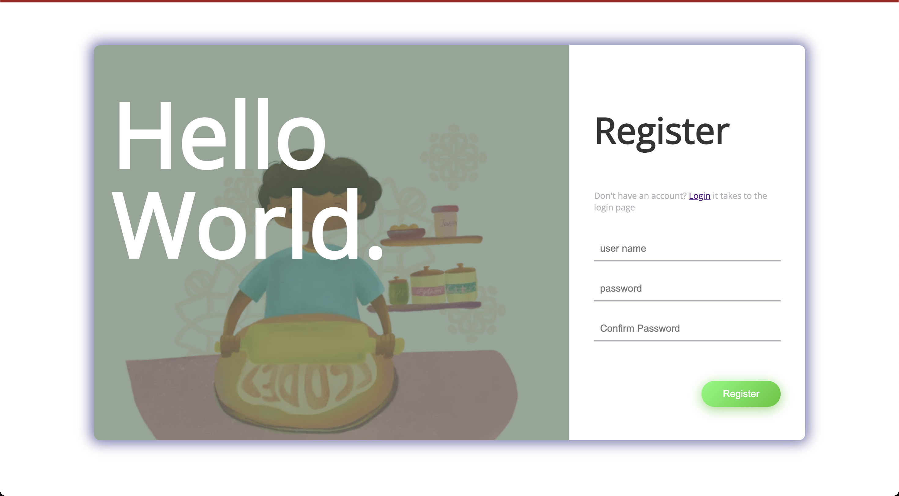
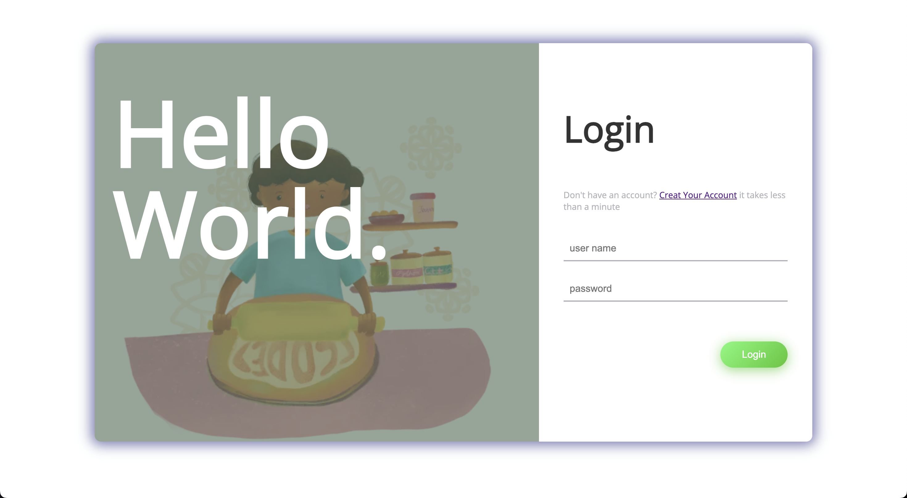
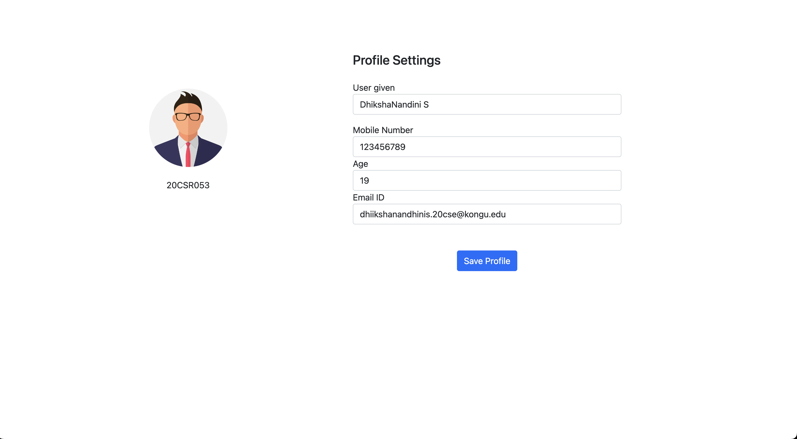

# GUVI TASK

This is a simple login/signup application with an edit form, built using PHP. The application uses MySQL, MongoDB, and Redis for data storage.

## Hosted Link

- [AWS](http://34.205.84.110/)

## Reference

- [PHP](https://www.php.net/docs.php)
- [MySQL](https://www.php.net/manual/en/mysql.php)
- [MongoDB](https://www.php.net/manual/en/book.mongodb.php)
- [Redis](https://redis.io/docs/)

## Features

- Login
- Signin
- Register
- Profile
- Edit user

## Installation

#### PHP

#### Update your package manager

```bash
 sudo apt update
```

#### Install PHP

```bash
 sudo apt install php
```

#### Php Installed version

```bash
 php -v
```

#### MongoDB

#### Install MongoDB

```bash
sudo apt-get install -y mongodb-org
```

#### Start the MongoDB service

```bash
sudo systemctl start mongod
```

#### Verify the installation

```bash
mongo --version
```

#### Redis

#### Install Redis

```bash
sudo apt install redis-server
```

#### Start the Redis service

```bash
sudo systemctl start mongod
```

#### Verify the installation

```bash
redis-cli ping
```

## Environment Variables

To run this project, you will need to add the following environment variables to your .env file

### MySQL

`MySQL_HOST`
`MySQL_USERNAME`
`MySQL_PASSWORD`
`MySQL_DATABASE`

### MongoDB

`MongoDB_LINK`

### Redis

`Redis_LINK`
`Redis_PORT`
`Redis_AUTH`

## API Reference

#### Get User Details

```http
  GET /profile
```

| Parameter  | Type     | Description                         |
| :--------- | :------- | :---------------------------------- |
| `redis id` | `string` | **Required**. Your Session Redis ID |

#### User Login

```http
  POST /login
```

| Parameter  | Type     | Description           |
| :--------- | :------- | :-------------------- |
| `username` | `string` | **Required**.username |
| `password` | `string` | **Required**.password |

#### User Registeration

```http
  POST /register
```

| Parameter  | Type     | Description           |
| :--------- | :------- | :-------------------- |
| `username` | `string` | **Required**.username |
| `password` | `string` | **Required**.password |

## Appendix

This application is developed for MacOS

## Authors

- [@gandhamathanv](https://www.github.com/gandhamathanv)

## Feedback

If you have any feedback, please reach out to us at gandhamathanv.20cse@kongu.edu

## Screenshots





